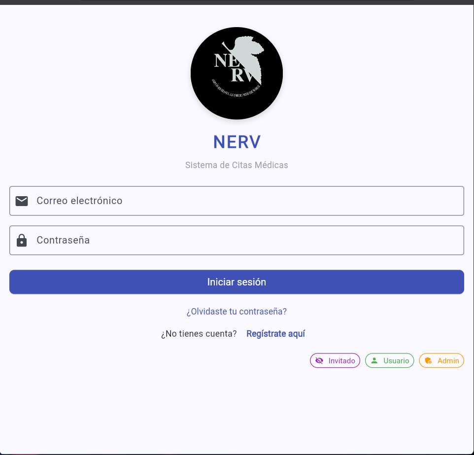
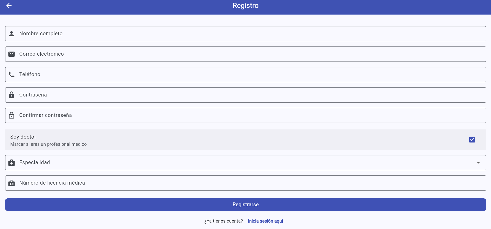
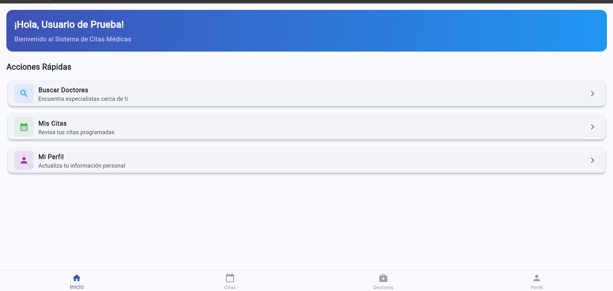
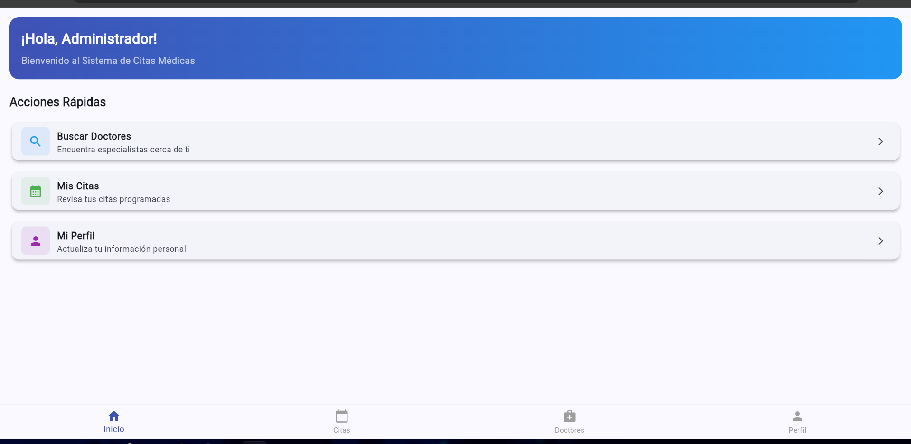
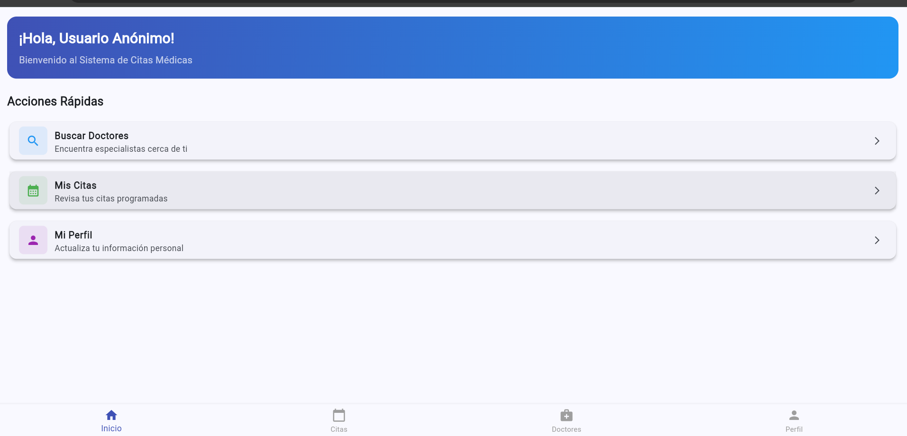
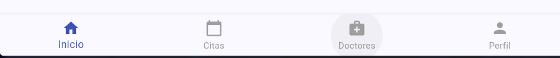
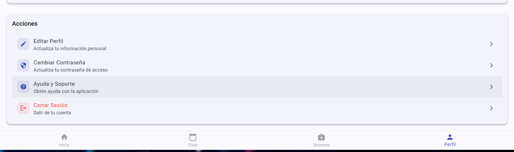
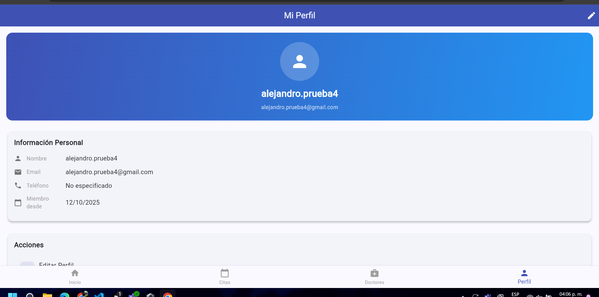
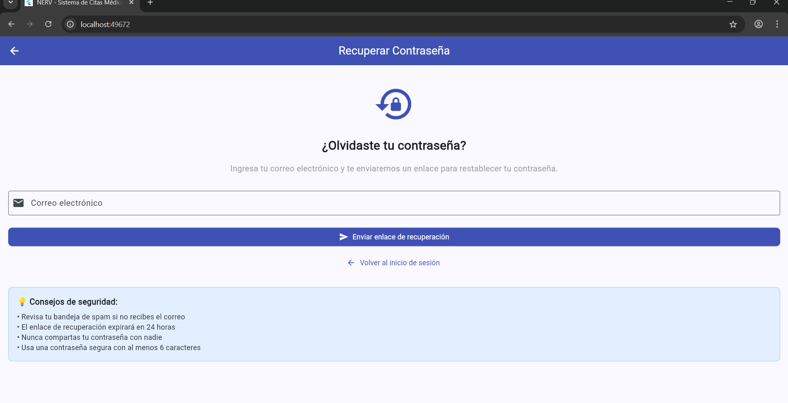

# NERV - Sistema de Citas Médicas

> Aplicación móvil multiplataforma para la gestión eficiente de citas médicas entre pacientes y profesionales de la salud.


---

## Tabla de Contenidos

- [Descripción General](#descripción-general)
- [Características](#características)
- [Tecnologías](#tecnologías)
- [Instalación](#instalación)
- [Estructura del Proyecto](#estructura-del-proyecto)
- [Configuración](#configuración)
- [Usuarios de Prueba](#usuarios-de-prueba)
- [Capturas de Pantalla](#capturas-de-pantalla)
- [Estado del Desarrollo](#estado-del-desarrollo)
- [Información Académica](#información-académica)

---

## Descripción General

**NERV** es un sistema integral de gestión de citas médicas desarrollado como proyecto académico del cuarto cuatrimestre. La aplicación permite a pacientes agendar citas con doctores especializados, gestionar su historial médico y facilitar la comunicación entre profesionales de la salud y pacientes.

Desarrollado con Flutter para garantizar compatibilidad multiplataforma (Android, iOS, Web, Desktop) y Firebase como backend para autenticación en tiempo real y almacenamiento de datos en la nube.

### Objetivos del Proyecto

- Implementar arquitectura limpia y escalable
- Integrar servicios de Firebase (Authentication, Firestore)
- Diseñar interfaces de usuario centradas en la experiencia del usuario
- Desarrollar aplicación multiplataforma con una única base de código
- Aplicar principios de desarrollo móvil moderno


## Características

### Módulo de Pacientes

| Funcionalidad | Descripción | Estado |
|--------------|-------------|--------|
| Registro de Usuario | Crear cuenta con validación de datos | Implementado |
| Autenticación | Login con email/password y login anónimo | Implementado |
| Búsqueda de Doctores | Filtrar por especialidad y búsqueda por nombre | Implementado |
| Visualización de Citas | Ver historial y citas programadas | Implementado |
| Gestión de Perfil | Actualizar información personal | Implementado |
| Agendamiento de Citas | Reservar citas con doctores | En desarrollo |

### Módulo de Doctores

| Funcionalidad | Descripción | Estado |
|--------------|-------------|--------|
| Registro Profesional | Registro con especialidad y licencia médica | Implementado |
| Panel de Control | Dashboard con estadísticas y métricas | Implementado |
| Gestión de Citas | Ver y administrar citas programadas | Implementado |
| Perfil Profesional | Información médica y credenciales | Implementado |
| Sistema de Calificaciones | Recibir valoraciones de pacientes | En desarrollo |

### Módulo de Administración

| Funcionalidad | Descripción | Estado |
|--------------|-------------|--------|
| Acceso Rápido | Login directo con credenciales predefinidas | Implementado |
| Gestión de Usuarios | Administrar pacientes y doctores | Planificado |
| Reportes y Estadísticas | Métricas generales del sistema | Planificado |

---

## Tecnologías

### Stack Tecnológico

```yaml
Frontend Framework: Flutter 3.9.2+
Lenguaje: Dart
Backend as a Service: Firebase
  - Firebase Authentication
  - Cloud Firestore
Gestión de Estado: Provider 6.1.2
Diseño UI/UX: Material Design 3
```

### Dependencias Principales

| Paquete | Versión | Propósito |
|---------|---------|-----------|
| `firebase_core` | ^2.32.0 | Configuración de Firebase |
| `firebase_auth` | ^4.20.0 | Autenticación de usuarios |
| `cloud_firestore` | ^4.17.5 | Base de datos en tiempo real |
| `provider` | ^6.1.2 | Gestión de estado |
| `intl` | ^0.19.0 | Internacionalización y formato de fechas |
| `http` | ^1.2.2 | Peticiones HTTP |

---

## Instalación

### Prerrequisitos

Antes de comenzar, asegúrate de tener instalado:

- [Flutter SDK](https://flutter.dev/docs/get-started/install) (versión 3.9.2 o superior)
- [Dart SDK](https://dart.dev/get-dart) (incluido con Flutter)
- [Git](https://git-scm.com/)
- Editor de código ([VS Code](https://code.visualstudio.com/) o [Android Studio](https://developer.android.com/studio))
- Cuenta de [Firebase](https://console.firebase.google.com/)

### Pasos de Instalación

1. **Clonar el repositorio**

```bash
git clone https://github.com/[TU_USUARIO]/sistema_citas_medicas.git
cd sistema_citas_medicas
```

2. **Instalar dependencias**

```bash
flutter pub get
```

3. **Verificar instalación de Flutter**

```bash
flutter doctor
```

4. **Ejecutar la aplicación**

Para Web:
```bash
flutter run -d chrome
```

Para Android:
```bash
flutter run -d android
```

Para iOS:
```bash
flutter run -d ios
```

---

## Estructura del Proyecto

```
sistema_citas_medicas/
│
├── android/                    # Configuración Android
├── ios/                        # Configuración iOS
├── web/                        # Configuración Web
├── windows/                    # Configuración Windows
├── linux/                      # Configuración Linux
├── macos/                      # Configuración macOS
│
├── assets/                     # Recursos estáticos
│   └── images/
│       └── logo.jpeg          # Logo de la aplicación
│
├── lib/                        # Código fuente principal
│   ├── constants/             # Constantes de la aplicación
│   │   └── app_constants.dart
│   │
│   ├── models/                # Modelos de datos
│   │   ├── user_model.dart
│   │   ├── appointment_model.dart
│   │   └── specialty_model.dart
│   │
│   ├── services/              # Servicios y lógica de negocio
│   │   ├── admin_service.dart
│   │   └── firestore_service.dart
│   │
│   ├── tabs/                  # Pantallas de la aplicación
│   │   ├── simple_login_page.dart
│   │   ├── login_page.dart
│   │   ├── register_page.dart
│   │   ├── forgot_password_page.dart
│   │   ├── dashboard_page.dart
│   │   ├── appointments_page.dart
│   │   ├── doctors_page.dart
│   │   └── profile_page.dart
│   │
│   ├── utils/                 # Utilidades
│   │   └── date_utils.dart
│   │
│   ├── firebase_options.dart  # Configuración Firebase
│   └── main.dart             # Punto de entrada
│
├── docs/                       # Documentación
│   └── images/                # Imágenes para el README
│       ├── screenshot_login.png
│       ├── screenshot_dashboard.png
│       ├── screenshot_doctors.png
│       └── screenshot_profile.png
│
├── pubspec.yaml               # Dependencias del proyecto
├── README.md                  # Este archivo
└── firebase.json              # Configuración de Firebase

```

---

## Configuración

### Configuración de Firebase

#### 1. Crear Proyecto en Firebase

1. Acceder a [Firebase Console](https://console.firebase.google.com/)
2. Crear nuevo proyecto llamado "sistema-citas-medicas"
3. Habilitar Google Analytics (opcional)

#### 2. Habilitar Servicios

**Authentication:**
1. Ir a Authentication > Sign-in method
2. Habilitar "Email/Password"
3. Habilitar "Anonymous" (opcional)

**Firestore Database:**
1. Ir a Firestore Database
2. Crear base de datos en modo "production"
3. Configurar reglas de seguridad:

```javascript
rules_version = '2';
service cloud.firestore {
  match /databases/{database}/documents {
    match /users/{userId} {
      allow read: if request.auth != null;
      allow write: if request.auth.uid == userId;
    }
    match /appointments/{appointmentId} {
      allow read: if request.auth != null;
      allow write: if request.auth != null;
    }
  }
}
```

#### 3. Configurar Flutter con Firebase

El proyecto ya incluye `firebase_options.dart` con las configuraciones necesarias para:
- Android
- iOS
- Web
- Windows
- macOS

**Proyecto Firebase:** `doctor-appoitment-4b`

---

## Usuarios de Prueba

### Credenciales Predefinidas

El sistema crea automáticamente usuarios de prueba al iniciar la aplicación:

| Tipo | Email | Contraseña | Descripción |
|------|-------|------------|-------------|
| Administrador | `admin@sistemacitas.com` | `admin123` | Acceso administrativo completo |
| Usuario Normal | `usuario@test.com` | `123456` | Usuario paciente estándar |
| Invitado | N/A | N/A | Login anónimo sin credenciales |

### Acceso Rápido en Login

La pantalla de login incluye botones de acceso rápido:

- **Invitado** (morado) - Login anónimo
- **Usuario** (verde) - Usuario de prueba
- **Admin** (naranja) - Administrador

---

## Capturas de Pantalla

### Pantalla de Login

*Autenticación con opciones de acceso rápido y login anónimo*

### Pantalla de Registro

*Formulario completo de registro para pacientes y doctores*

### Dashboard - Usuario de Prueba

*Panel personalizado para usuario de prueba*

### Dashboard - Administrador

*Panel de control para administrador*

### Dashboard - Usuario Anónimo

*Panel para usuarios invitados*

### Menú de Navegación

*Sistema de navegación con tabs inferiores*

### Perfil de Usuario

*Gestión de información personal y estadísticas*

### Gestión de Usuarios

*Lista de usuarios registrados en el sistema*

### Recuperación de Contraseña

*Pantalla de recuperación de contraseña*

---

## Estado del Desarrollo

### Funcionalidades Completadas

| Módulo | Funcionalidad | Progreso |
|--------|--------------|----------|
| Autenticación | Login con email/password | 100% |
| Autenticación | Registro de usuarios | 100% |
| Autenticación | Login anónimo | 100% |
| Autenticación | Recuperación de contraseña (UI) | 100% |
| Navegación | Sistema de tabs con BottomNavigationBar | 100% |
| Perfiles | Visualización de datos de usuario | 100% |
| Doctores | Búsqueda y filtrado | 100% |
| Citas | Visualización de citas | 100% |
| UI/UX | Tema médico profesional | 100% |

### En Desarrollo

| Funcionalidad | Prioridad | Estado |
|--------------|-----------|--------|
| Agendamiento de citas | Alta | Planificado |
| Sistema de notificaciones | Media | Planificado |
| Chat en tiempo real | Baja | Planificado |
| Historial médico completo | Media | Planificado |
| Sistema de pagos | Baja | Planificado |

---

## Información Académica

### Detalles del Proyecto

| Campo | Información |
|-------|-------------|
| **Institución** | Universidad [Nombre] |
| **Carrera** | Ingeniería en Sistemas / Desarrollo de Software |
| **Materia** | Desarrollo de Aplicaciones Móviles |
| **Periodo** | Cuarto Cuatrimestre |
| **Año** | 2025 |
| **Profesor** | [Nombre del Profesor] |

### Objetivos de Aprendizaje

- Desarrollo de aplicaciones multiplataforma con Flutter
- Integración de servicios backend en la nube (Firebase)
- Implementación de autenticación y autorización
- Diseño de bases de datos NoSQL (Firestore)
- Aplicación de patrones de diseño y arquitectura limpia
- Gestión de estado en aplicaciones móviles
- Desarrollo de interfaces de usuario responsivas

---

## Comandos Útiles

### Desarrollo

```bash
# Ejecutar en modo desarrollo
flutter run

# Ejecutar en web
flutter run -d chrome

# Hot reload (en app en ejecución)
r

# Hot restart (en app en ejecución)
R

# Analizar código
flutter analyze

# Formatear código
flutter format .

# Limpiar build
flutter clean
```

### Testing

```bash
# Ejecutar tests
flutter test

# Ejecutar tests con coverage
flutter test --coverage

# Ver coverage
genhtml coverage/lcov.info -o coverage/html
```

### Build

```bash
# Build para Android
flutter build apk

# Build para iOS
flutter build ios

# Build para Web
flutter build web

# Build para Windows
flutter build windows
```

---

## Modelos de Datos

### UserModel

```dart
{
  id: String,
  email: String,
  name: String,
  phone: String,
  profileImage: String?,
  createdAt: DateTime,
  updatedAt: DateTime,
  isDoctor: bool,
  specialty: String?,        // Solo doctores
  licenseNumber: String?,    // Solo doctores
  rating: double?,           // Solo doctores
  totalAppointments: int?    // Solo doctores
}
```

### AppointmentModel

```dart
{
  id: String,
  patientId: String,
  doctorId: String,
  patientName: String,
  doctorName: String,
  specialty: String,
  appointmentDate: DateTime,
  timeSlot: String,
  status: AppointmentStatus,
  type: AppointmentType,
  notes: String?,
  symptoms: String?,
  diagnosis: String?,
  prescription: String?,
  cost: double?,
  createdAt: DateTime,
  updatedAt: DateTime
}
```

### Enumeraciones

**AppointmentStatus:**
- `pending` - Cita pendiente de confirmación
- `confirmed` - Cita confirmada
- `completed` - Cita completada
- `cancelled` - Cita cancelada

**AppointmentType:**
- `consultation` - Consulta general
- `followUp` - Seguimiento
- `emergency` - Emergencia
- `routine` - Revisión rutinaria

---

## Especialidades Médicas

El sistema soporta las siguientes especialidades médicas:

| Especialidad | Precio Base | Duración Promedio |
|--------------|-------------|-------------------|
| Medicina General | $50.00 | 30 minutos |
| Cardiología | $80.00 | 45 minutos |
| Dermatología | $60.00 | 30 minutos |
| Pediatría | $55.00 | 30 minutos |
| Ginecología | $70.00 | 40 minutos |
| Ortopedia | $75.00 | 45 minutos |
| Neurología | $90.00 | 60 minutos |
| Oftalmología | $65.00 | 30 minutos |

---

## Configuración de Colores

### Paleta de Colores Principal

```dart
Primary Color:    #1976D2  // Azul médico
Secondary Color:  #42A5F5  // Azul claro
Accent Color:     #26A69A  // Verde agua
Error Color:      #E57373  // Rojo suave
Success Color:    #81C784  // Verde éxito
Warning Color:    #FFB74D  // Naranja advertencia
```

### Botones de Acceso Rápido

```dart
Invitado:  Purple (#9C27B0)
Usuario:   Green (#4CAF50)
Admin:     Orange (#FF9800)
```

---

## Compatibilidad de Plataformas

| Plataforma | Versión Mínima | Estado |
|------------|----------------|--------|
| Android | API 21 (Android 5.0) | Soportado |
| iOS | iOS 11.0+ | Soportado |
| Web | Navegadores modernos | Soportado |
| Windows | Windows 10+ | Soportado |
| macOS | macOS 10.14+ | Soportado |
| Linux | Ubuntu 18.04+ | Soportado |

---

## Arquitectura

### Patrón de Diseño

El proyecto implementa una arquitectura modular basada en:

```
Presentación (UI)
    ↓
Lógica de Negocio (Services)
    ↓
Acceso a Datos (Firebase)
```

### Flujo de Autenticación

```
Usuario → Login Page → Firebase Auth → Firestore → Dashboard
                ↓
          [Validación]
                ↓
           [UserModel]
```

---

## Configuración Avanzada

### Variables de Entorno

Las constantes de la aplicación se encuentran en:

**Archivo:** `lib/constants/app_constants.dart`

```dart
// Configuración de Administrador
adminEmail: 'admin@sistemacitas.com'
adminPassword: 'admin123'

// Usuario de Prueba
testUserEmail: 'usuario@test.com'
testUserPassword: '123456'

// Configuración de Colores
primaryColorValue: 0xFF1976D2
secondaryColorValue: 0xFF42A5F5
```

### Colecciones de Firestore

**users**
```
/users/{userId}
  - id: string
  - email: string
  - name: string
  - phone: string
  - isDoctor: boolean
  - specialty: string (opcional)
  - createdAt: timestamp
```

**appointments**
```
/appointments/{appointmentId}
  - patientId: string
  - doctorId: string
  - appointmentDate: timestamp
  - status: string
  - type: string
  - createdAt: timestamp

## Capturas de Pantalla


---

## Contacto y Soporte

### Desarrollador

**Nombre:** [Tu Nombre]  
**Email:** [tu.email@universidad.edu]  
**GitHub:** [@TuUsuario](https://github.com/TuUsuario)

### Soporte del Proyecto

Para reportar bugs o solicitar features:
- [Issues](https://github.com/[TU_USUARIO]/sistema_citas_medicas/issues)
- [Discussions](https://github.com/[TU_USUARIO]/sistema_citas_medicas/discussions)

---

## Licencia

Este proyecto es un trabajo académico desarrollado con fines educativos.

```
MIT License

Copyright (c) 2025 [Tu Nombre]

Se permite el uso, copia, modificación y distribución de este software
con fines académicos y educativos.
```

---

## Agradecimientos

- **Flutter Team** - Framework de desarrollo
- **Firebase Team** - Backend as a Service
- **Material Design** - Sistema de diseño
- **Comunidad de Flutter** - Recursos y documentación
- **Universidad [Nombre]** - Apoyo académico

---

## Información del Repositorio

**Última Actualización:** Octubre 2025  
**Versión:** 1.0.0  
**Estado:** En Desarrollo Activo  
**Tipo:** Proyecto Académico

---

**Desarrollado con Flutter para el Cuarto Cuatrimestre - 2025**
